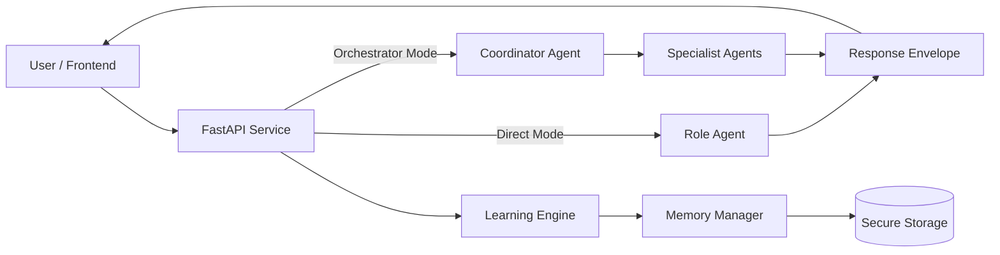
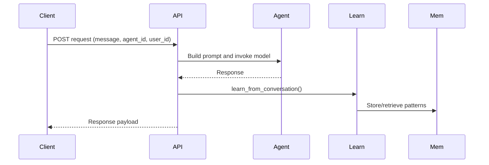
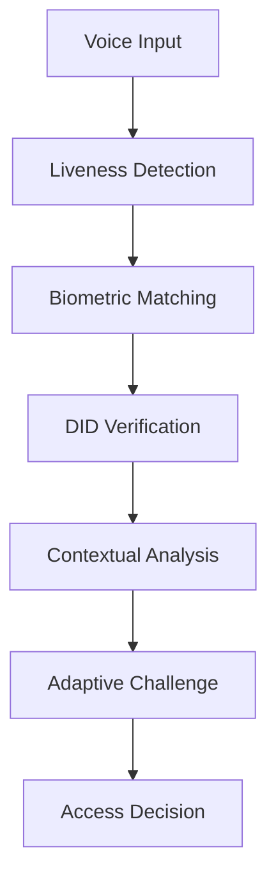
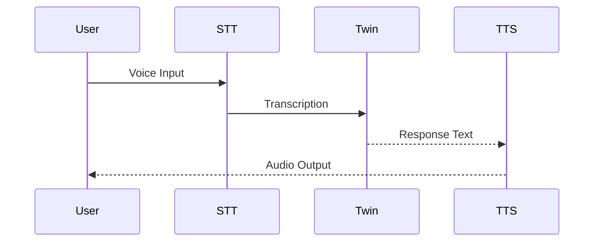
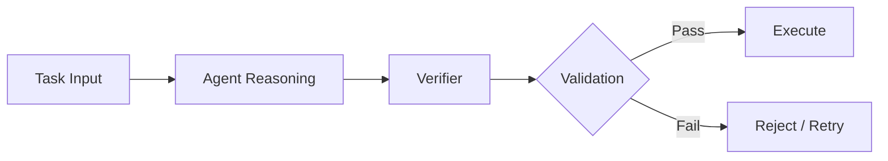
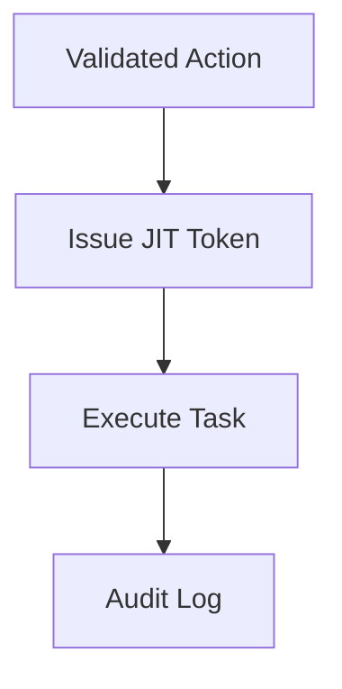
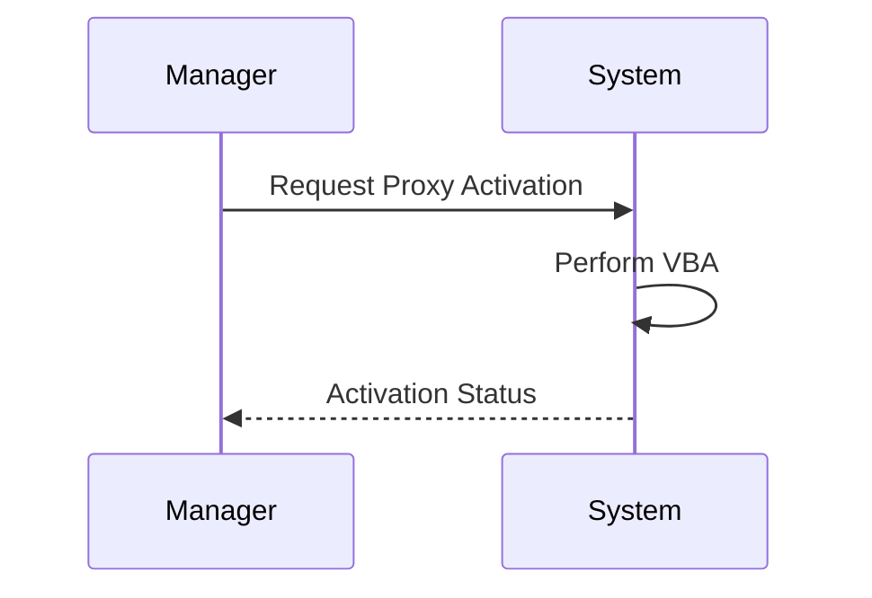
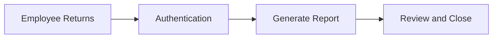

<<<<<<< HEAD
# AppBank Proxy 2026

## Secure Agentic Twin System

### Industry-Standard Technical Documentation

---

# 1. Introduction

## 1.1 Purpose

This document defines the architecture, components, and operational workflow for the AppBank Proxy 2026 system, an enterprise-grade Agentic AI platform. The system enables a secure, verifiable AI "Twin" to act on behalf of an employee while maintaining strict compliance, auditability, and zero-trust security principles.

## 1.2 Scope

This specification covers:

* Multi-layer voice biometric authentication (VBA)
* Real-time communication gateway
* Verifiable AI reasoning and execution (RLVR-inspired)
* Secure proxy-based task execution
* Operational lifecycle management
* Implementation roadmap

## 1.3 System Overview

The AppBank Proxy system extends employee identity into a cryptographically bound AI agent capable of executing tasks under controlled, auditable conditions.

---

# 2. System Architecture

## 2.1 High-Level Architecture



---

## 2.2 Request Flow



---

# 3. Security Architecture: 5-Layer VBA Framework

## 3.1 Overview

The system enforces a multi-layer Voice Biometric Authentication (VBA) pipeline prior to enabling any privileged action.



---

## 3.2 Layer Definitions

### 3.2.1 Layer 1: Liveness Detection

* Detects synthetic or replayed audio
* Identifies vocoder artifacts and phase inconsistencies
* Rejects deepfake attempts

### 3.2.2 Layer 2: Biometric Matching

* Uses speaker embeddings (e.g., ECAPA-TDNN)
* Compares against stored identity profiles
* Acceptance threshold: similarity score > 0.92

### 3.2.3 Layer 3: Decentralized Identity Binding

* Implements W3C DID standard
* Validates voiceprint hash against Verifiable Credentials (VC)
* Credentials stored in decentralized wallet

### 3.2.4 Layer 4: Contextual Anomaly Detection

* Behavioral analysis based on:
  * Speech cadence
  * Intent patterns
* Anomaly threshold: > 0.7 triggers escalation

### 3.2.5 Layer 5: Adaptive Challenge

* Dynamic passphrase challenge
* Seeded using FIDO2 mechanisms
* Requires real-time spoken response

---

# 4. Communication Gateway

## 4.1 Overview

The communication layer enables real-time interaction between the user and the AI Twin.



---

## 4.2 Functional Requirements

### 4.2.1 Real-Time Transcription

* Latency target: <150 ms
* Supports streaming input processing

### 4.2.2 Zero-Retention Processing

* Audio processed in memory only
* No persistent storage of raw audio

### 4.2.3 Voice Output

* High-fidelity voice synthesis
* Embedded watermark for transparency and compliance

---

# 5. Logic Core: Verifiable Reasoning System

## 5.1 Overview

The system implements a verification-first execution model to eliminate hallucinations.



---

## 5.2 Components

### 5.2.1 Reasoning Engine

* Large Language Model (LLM)
* Generates proposed actions or code

### 5.2.2 Verifier Layer

* Python-based validation system
* Executes proposed actions in isolated sandbox
* Enforces:
  * Policy compliance
  * Logical correctness
  * Resource constraints

---

## 5.3 Reward Function

The system evaluates actions using:

R = (C × L) − P

Where:

* C = Compliance (binary)
* L = Logical correctness (binary)
* P = Risk penalty

---

## 5.4 Execution Environment

* Containerized sandbox (e.g., Docker)
* No direct production access without validation

---

# 6. Proxy Execution Framework

## 6.1 Overview

The AI Twin executes tasks using controlled, temporary permissions.



---

## 6.2 Security Controls

### 6.2.1 Just-In-Time Access

* Temporary IAM tokens
* Scoped permissions

### 6.2.2 Hard Constraints

* Predefined operational limits
* Example:
  * Financial transaction caps
  * Restricted destructive actions

### 6.2.3 Immutable Audit Logging

* All actions recorded in tamper-proof ledger
* Supports full traceability and compliance audits

---

# 7. Operational Lifecycle

## 7.1 Activation Phase



* Manager authorization required
* VBA validation enforced

---

## 7.2 Active Operation

The AI Twin performs:

* Code and task execution
* Stakeholder communication
* Reporting and monitoring

---

## 7.3 Recovery and Handover



### Output:

* Delta report summarizing actions taken
* Full audit logs available

---

# 8. Data Management

## 8.1 Memory Architecture

* Short-term conversational memory
* Long-term pattern storage
* Secure storage backend (e.g., DynamoDB or equivalent)

## 8.2 Data Security

* Encryption at rest and in transit
* Access governed by IAM policies

---

# 9. Compliance and Governance

## 9.1 Regulatory Alignment

* ISO/IEC 30107-3 (biometric spoof detection)
* W3C DID standards
* FIDO2 authentication
* Financial audit requirements

## 9.2 Transparency

* All AI-generated outputs are identifiable
* Proxy actions are explicitly logged

---

# 10. Implementation Roadmap

| Phase | Timeline | Description |
| --- | --- | --- |
| Phase 1 | Weeks 1-4 | Implement VBA framework and identity binding |
| Phase 2 | Weeks 5-8 | Deploy real-time communication layer |
| Phase 3 | Weeks 9-12 | Build verification and sandbox environment |
| Phase 4 | Weeks 13+ | Pilot deployment in shadow mode |

---

# 11. Non-Functional Requirements

## 11.1 Performance

* End-to-end latency: <200 ms (interactive tasks)
* High availability (99.9% uptime target)

## 11.2 Scalability

* Microservices-based architecture
* Horizontal scaling for agent workloads

## 11.3 Security

* Zero-trust architecture
* Continuous authentication and monitoring

---

# 12. Conclusion

The AppBank Proxy 2026 system establishes a secure, verifiable, and auditable framework for AI-driven task execution. By combining multi-layer authentication, verifiable reasoning, and controlled execution, the system enables AI agents to function as trusted extensions of human identity in regulated environments.

---

# 13. Future Enhancements

* Advanced anti-spoofing models for synthetic media detection
* Formal verification for critical financial logic
* Federated identity integration across organizations
* Continuous learning with policy-aware constraints

---

End of Document

---

# 14. Repository Build Baseline

This repository now contains the first product-oriented baseline for implementation.

## 14.1 Repository Layout

```text
backend/
	.venv/
	appbank_digital_twin/
		api/
			routes/
		core/
		schemas/
		services/
		main.py
	requirements.txt
docs/
	architecture.md
	security.md
	implementation-plan.md
	service-map.md
```

## 14.2 Implementation Documents

* See `docs/architecture.md` for service-level decomposition.
* See `docs/security.md` for a build sequence for the 5-layer VBA model.
* See `docs/service-map.md` for ownership boundaries across backend components.
* See `docs/implementation-plan.md` for the actual execution roadmap from MVP to regulated deployment.

## 14.3 Backend Starter

The backend starter is intentionally minimal.

It provides:

* App configuration loading
* Health endpoint
* Placeholder execution endpoint for future orchestration
* Clean package structure for the actual product build

## 14.4 Next Build Step

Start with the backend control plane first:

1. identity and session APIs
2. voice verification pipeline contracts
3. verifier and policy engine contracts
4. proxy execution token issuance

Only then connect STT, TTS, and frontend session orchestration.
=======
# demo_concept
>>>>>>> 7c1d7f0584cc9110ae970995e009e8bd7532bd61
