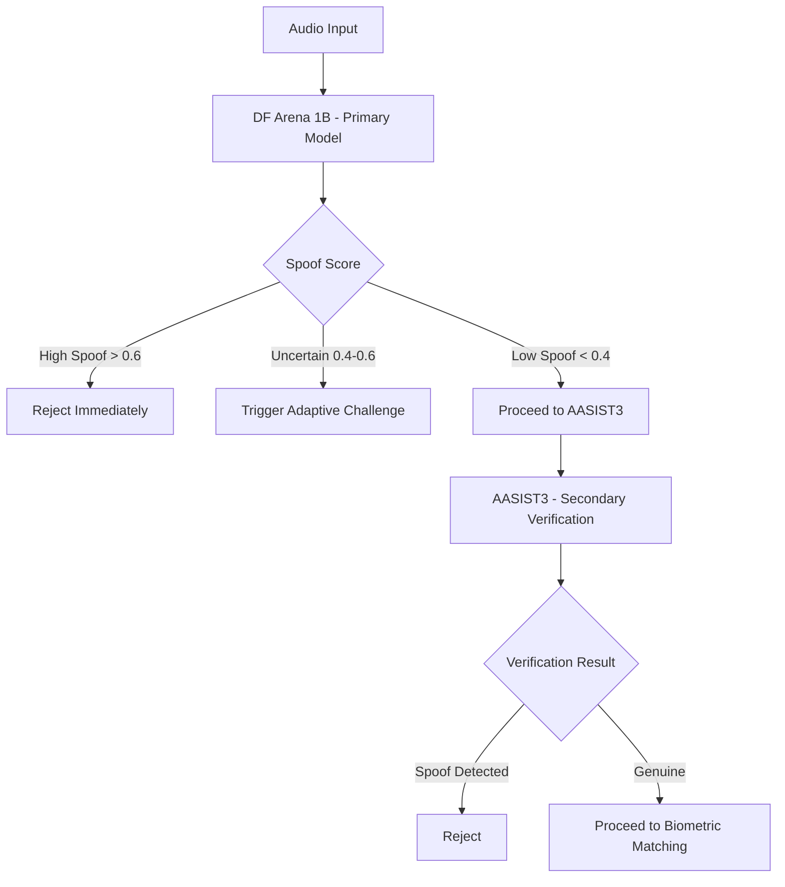

# AppBank Proxy 2026 Security Build Guide

## Security Principle

The product should be built under a zero-trust assumption:

* no direct trust in voice alone
* no direct execution from agent output alone
* no production privilege without verifier approval and scoped credentials

## Build the 5-Layer VBA Stack in Stages

### Stage 1: Liveness Detection

Goal:

* reject replayed and synthetic audio before biometric matching

Implementation tasks:

* define audio ingestion contract
* add anti-replay checks
* integrate spoof-detection model
* emit liveness confidence and rejection reason

Exit criteria:

* every audio session yields `live`, `spoofed`, or `uncertain`

### Stage 2: Biometric Matching

Goal:

* compare enrolled speaker embeddings with current session embeddings

Implementation tasks:

* define voice enrollment lifecycle
* store embeddings securely
* version the embedding model
* configure environment-specific thresholds

Exit criteria:

* session yields `similarity_score`, `threshold_used`, and `match_decision`

### Stage 3: DID and VC Binding

Goal:

* bind biometric identity to enterprise identity proofs

Implementation tasks:

* store voiceprint hash references, not raw audio
* validate VC claims against enterprise identity records
* support wallet or enterprise identity provider integration

Exit criteria:

* privileged actions require biometric match plus identity credential validation

### Stage 4: Contextual Anomaly Detection

Goal:

* identify suspicious behavioral deviations even when voice matches

Implementation tasks:

* define behavioral features
* compute anomaly score per session
* add escalation paths for medium-risk and high-risk sessions

Exit criteria:

* anomaly score is mandatory for high-risk operations

### Stage 5: Adaptive Challenge

Goal:

* add a live challenge-response gate before privileged execution

Implementation tasks:

* generate challenge phrases dynamically
* bind challenge to live session nonce
* verify low-latency spoken response

Exit criteria:

* financial or destructive actions require successful challenge completion

## Security Controls Outside VBA

### Verifier Controls

* no action executes directly from LLM output
* all execution requests are structured and validated
* risk-scored actions require step-up approval

### Execution Controls

* just-in-time tokens only
* scoped permissions only
* token expiry in minutes, not hours
* immutable audit records for every action

### Data Controls

* no raw audio persistence by default
* encryption at rest and in transit
* explicit data retention policy
* auditable access to embeddings and identity metadata

## Sequential Anti-Spoofing Pipeline

The first streaming intake path should follow a sequential decision model instead of parallel model fusion.

### Processing Flow

### Decision Table

| Stage | Condition | Action |
| --- | --- | --- |
| Primary | Spoof score > 0.6 | Immediate rejection |
| Primary | Score 0.4-0.6 | Adaptive challenge |
| Primary | Score < 0.4 | Forward to secondary model |
| Secondary | Spoof detected | Reject |
| Secondary | Genuine | Proceed to biometric matching |

### Backend Integration

The websocket intake route should:

* accept audio chunks in memory only
* run primary anti-spoofing first
* avoid STT handoff unless the audio reaches `proceed_biometric`
* return `reject`, `challenge`, or `proceed_biometric`

### Current Baseline

The current repository implements a realtime intake endpoint at `/v1/stt/ws` with:

* in-memory audio session buffering
* primary decision thresholds at 0.4 and 0.6
* secondary verification before STT handoff readiness

The current model scoring logic is a placeholder heuristic adapter for the DF Arena and AASIST3 stages. It establishes the control flow and contracts so the real models can be plugged in without changing the websocket protocol.
